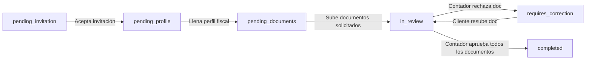

**No son datos de relleno. Se guardan 100% en la Base de Datos y son fundamentales para el proceso tributario.**

---

### 1. 💾 ¿Se guardan en la Base de Datos?

**Sí.** Al presionar _"Guardar perfil tributario"_, la información se envía mediante una petición HTTP `PATCH /api/v1/portal/profile` y se almacena en la tabla **`tax_profiles`** de PostgreSQL, asociada directamente al ID del cliente.

Campos que se guardan en la tabla `tax_profiles`:

- **Tipos de ingreso:** `hasIngresosLaborales`, `hasIngresosIndependientes`, `hasRendimientosFinancieros`, `hasInversiones`.
- **Patrimonio:** `hasPropiedades`, `hasVehiculos`, `ingresosAnuales`, `patrimonioBruto`.
- **Deducciones solicitadas:** `hasDependientes`, `hasMedicinaPrepaga`, `hasCreditoHipotecario`, `hasAportesVoluntarios`.

---

### ⚙️ 2. ¿Para qué se emplean en el sistema?

Estos datos cumplen **3 funciones clave** en la aplicación:

#### A. Diagnóstico y Radiografía Fiscal para el Contador

Cuando el contador ingresa al detalle del cliente en el panel administrativo (`GET /api/v1/clients/:id`), consulta el `taxProfile` para entender la estructura financiera del cliente y saber qué cédulas de la DIAN aplicar en la declaración de renta (Cédula General, Rentas de Trabajo, Rentas de Capital, Patrimonio).

#### B. Generación y Filtrado de Documentos Requeridos (Checklist)

Sirve como filtro para solicitar únicamente los soportes tributarios necesarios:

- Si el cliente marca **Medicina prepagada** ➔ El sistema/contador solicita el _Certificado de Pagos a Medicina Prepagada_.
- Si marca **Crédito hipotecario** ➔ Se requiere el _Certificado de Intereses de Crédito Hipotecario_.
- Si marca **Ingresos laborales** ➔ Se solicita el _Certificado de Ingresos y Retenciones (Formulario 220)_.
- Si marca **Propiedades / Vehículos** ➔ Se solicita el _Impuesto Predial_ / _Impuesto de Vehículos_.

#### C. Avance Automático en la Línea de Tiempo del Cliente

Cuando el cliente diligencia y guarda su perfil tributario por primera vez:

1. El backend detecta que la etapa de perfil fue completada.
2. El estado del cliente pasa automáticamente de **`pending_profile`** a **`pending_documents`**.
3. En la barra de progreso del dashboard, el paso de **Perfil** se marca en azul como completado y se activa el siguiente paso (**Documentos**).

##### ------------------------------------------------------------------------------------------------------------------------ || ----------------------------------------------------------------------------------------------------------------------------------

Respuesta a tus inquietudes sobre el estado de la declaración:

### 1. ¿Está la información hardcodeada?

**No en el código, pero sí estaba en el registro de prueba inicial de la base de datos.**

El componente visual del portal de clientes ([portal-dashboard.component.ts](file:///c:/Users/tejod/Documents/Devs/RentDecla/frontend/src/app/portal/pages/dashboard/portal-dashboard.component.ts)) **no tiene datos quemados/hardcodeados**; lee dinámicamente el campo `status` retornado por el backend (`GET /api/v1/portal/me`).

Sin embargo, al ejecutar la siembra de datos de prueba (`seed.ts`), el registro del cliente _Juan Pérez_ (`cliente@rentdecla.com`) fue creado explícitamente con el estado `status = 'completed'`, razón por la cual la línea de tiempo mostraba todas las etapas en azul y el badge en "Completado".

---

### 2. ¿Cómo sabe realmente el cliente si su declaración está completada?

El sistema gestiona el progreso de la declaración a través de la columna `status` en la tabla `clients` de PostgreSQL y las revisiones realizadas por el contador. El flujo avanza automáticamente según las siguientes acciones:



1. **`pending_invitation` (Invitación pendiente):** El cliente fue invitado pero no ha creado su contraseña.
2. **`pending_profile` (Perfil pendiente):** El cliente activó su cuenta pero debe completar su información fiscal (RUT, ingresos, etc.).
3. **`pending_documents` (Documentos pendientes):** El cliente completó su perfil y tiene pendientes de subir los certificados/documentos solicitados.
4. **`in_review` (En revisión):** El cliente cargó sus documentos y el contador está revisándolos y elaborando la borrador de la declaración.
5. **`requires_correction` (Requiere corrección):** El contador revisó la documentación y rechazó o solicitó corrección en uno o más archivos.
6. **`completed` (Completado):** Ocurre **únicamente cuando el contador revisa y aprueba todos los documentos** del cliente (lógica en `DocumentReviewsService.syncClientStatus`).

---

### 🔄 Cambio Realizado para tus Pruebas

Se ha actualizado el script de datos de prueba y se ejecutó la actualización en la base de datos para que el usuario Juan Pérez (`cliente@rentdecla.com`) ahora tenga el estado **`pending_documents`** (_Documentos pendientes_).

Si recargas el Portal de Clientes ahora:

- Verás la barra de progreso avanzada hasta **Documentos** (el paso en el que se encuentra actualmente).
- A medida que subas archivos y el usuario **Contador** los apruebe desde el panel administrativo, el estado avanzará automáticamente a **En revisión** y finalmente a **Completado**.

## -------------------------------------------------------------------------------- || ---------------------------------------------------------------------

## -------------------------------------------------------------------------------- || ---------------------------------------------------------------------

El motivo por el cual los correos de invitación no estaban llegando a tu bandeja de entrada de correo real se debe a las siguientes razones principales y la solución aplicada:

---

### 1. 📬 Uso del Servidor de Pruebas (Mailtrap Sandbox)

En el archivo [backend/.env](file:///c:/Users/tejod/Documents/Devs/RentDecla/backend/.env), el sistema está configurado con Mailtrap:

```env
SMTP_HOST=sandbox.smtp.mailtrap.io
SMTP_PORT=2525
SMTP_USER=0a620816e943f0
SMTP_PASS=54893c5b8f522f
```

> **¿Por qué ocurre esto?**  
> **Mailtrap es un interceptor de pruebas para desarrollo.** Captura todos los correos salientes del sistema y los guarda en una bandeja virtual dentro de [mailtrap.io](https://mailtrap.io). **Nunca entrega correos a buzones reales** (como Gmail, Hotmail u Outlook) para evitar enviar correos de prueba a usuarios reales por accidente.

---

### 2. 📄 Plantillas HTML en Compilación (`dist/`)

Al compilar el proyecto (`nest build`), los archivos `.html` dentro de `src/modules/mailer/templates` no se copiaban al directorio `dist/`.

**Correcciones realizadas:**

- Se configuró [nest-cli.json](file:///c:/Users/tejod/Documents/Devs/RentDecla/backend/nest-cli.json) para incluir y compilar automáticamente los archivos de plantilla `.html`.
- Se actualizó [mailer.service.ts](file:///c:/Users/tejod/Documents/Devs/RentDecla/backend/src/modules/mailer/mailer.service.ts) para buscar plantillas en múltiples rutas del sistema y asegurar que el contenido nunca falle.

---

### 🛠️ Mejora Realizada para Pruebas Rápidas en Consola

Para facilitar las pruebas de registro sin depender de revisar Mailtrap o un SMTP externo:

Cada vez que **creas un cliente** o presionas **"Reenviar invitación"**, el backend imprime **directamente en la consola / terminal del servidor** la URL exacta con el token generado:

```bash
📧 [CLIENT INVITATION CREATED] Email: cliente@ejemplo.com | URL: http://192.168.1.77:4200/auth/accept-invitation?token=8a3f12bc-...
```

---

### ⚙️ ¿Cómo enviar correos a bandejas reales?

Si deseas que los correos lleguen a buzones reales de Gmail/Outlook, sólo debes actualizar las variables en tu [backend/.env](file:///c:/Users/tejod/Documents/Devs/RentDecla/backend/.env) con un servidor SMTP real:

#### Ejemplo con Gmail:

```env
SMTP_HOST=smtp.gmail.com
SMTP_PORT=587
SMTP_USER=tu_correo@gmail.com
SMTP_PASS=tu_contraseña_de_aplicacion_gmail
SMTP_SECURE=false
SMTP_FROM=noreply@rentdecla.com
```
